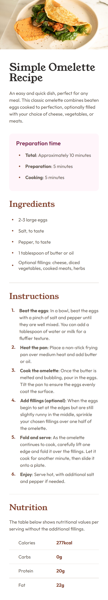
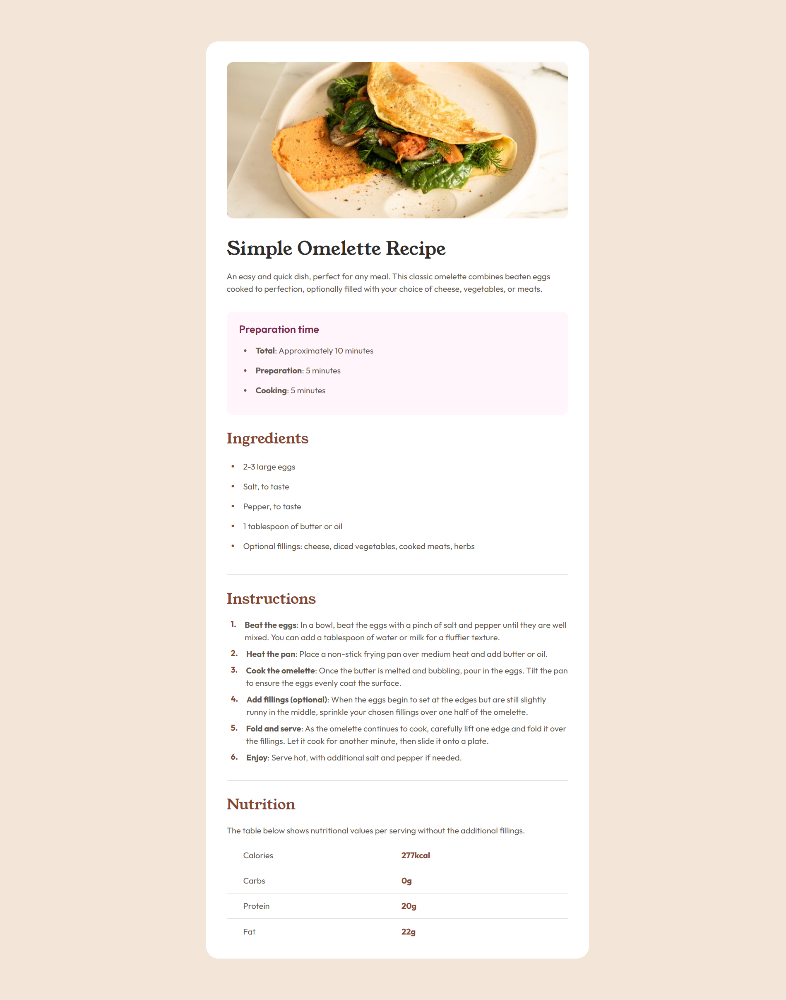

# Frontend Mentor - Recipe page solution

This is a solution to the [Recipe page challenge on Frontend Mentor](https://www.frontendmentor.io/challenges/recipe-page-KiTsR8QQKm). Frontend Mentor challenges help you improve your coding skills by building realistic projects.

## Table of contents

- [Overview](#overview)
  - [The challenge](#the-challenge)
  - [Screenshot](#screenshot)
  - [Links](#links)
- [My process](#my-process)
  - [Built with](#built-with)
  - [What I learned](#what-i-learned)
  - [Continued development](#continued-development)

## Overview

### Screenshot





### Links

- Solution URL: [GitHub Repo](https://github.com/akshitjain3/FEM-Recipe.git)
- Live Site URL: [GitHub Pages](https://akshitjain3.github.io/FEM-Recipe/)

## My process

### Built with

- Semantic HTML5 markup
- CSS custom properties
- Flexbox
- Mobile-first workflow

### What I learned

To give proper spacing to <li> markers and the values was a little difficult task having some space before a marker and after a marker not allowing the <li> text to wrap below its marker. But flexbox came to the rescue after many trial and errors with ::before and ::marker.

```html
<ul>
  <li>
    <p><strong>Total</strong>: Approximately 10 minutes</p>
  </li>
  <li>
    <p><strong>Preparation</strong>: 5 minutes</p>
  </li>
  <li>
    <p><strong>Cooking</strong>: 5 minutes</p>
  </li>
</ul>
```

```css
.recipe-content-cont ul > li {
  margin-bottom: 8px;
  display: flex;
  gap: 16px;
  padding-left: 8px;
  align-items: center;
}

.recipe-content-cont ul > li::before {
  content: "•";
  color: var(--brown-800);
  font-size: 24px;
}

.recipe-content-cont ol {
  counter-reset: list-counter;
  display: flex;
  flex-direction: column;
  gap: 8px;
}

.recipe-content-cont ol > li {
  display: flex;
  gap: 16px;
  padding-left: 8px;
  counter-increment: list-counter;
}

.recipe-content-cont ol > li::before {
  content: counter(list-counter) ".";
  font-size: 16px;
  font-family: "Outfit";
  font-weight: 700;
  color: var(--brown-800);
}
```

### Continued development

Currently the web page isn't as responsive as its features i want to learn, hope i can complete more advanced challenges.

```css
@media (min-width: 640px) {
  body {
    background-color: var(--stone-100);
    display: flex;
    align-items: center;
    justify-content: center;
  }

  .recipe-image {
    border-radius: 12px;
  }

  .recipe-outer-cont {
    padding: 40px;
    max-width: 740px;
    border-radius: 24px;
    background-color: var(--white);
    display: flex;
    flex-direction: column;
    gap: 40px;
    margin-block: 5rem;
    width: 90%;
  }

  .recipe-content-cont {
    padding: 0;
  }
}
```
